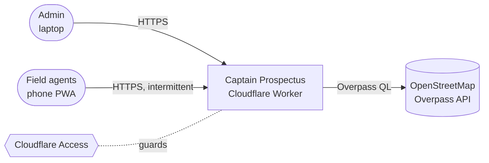
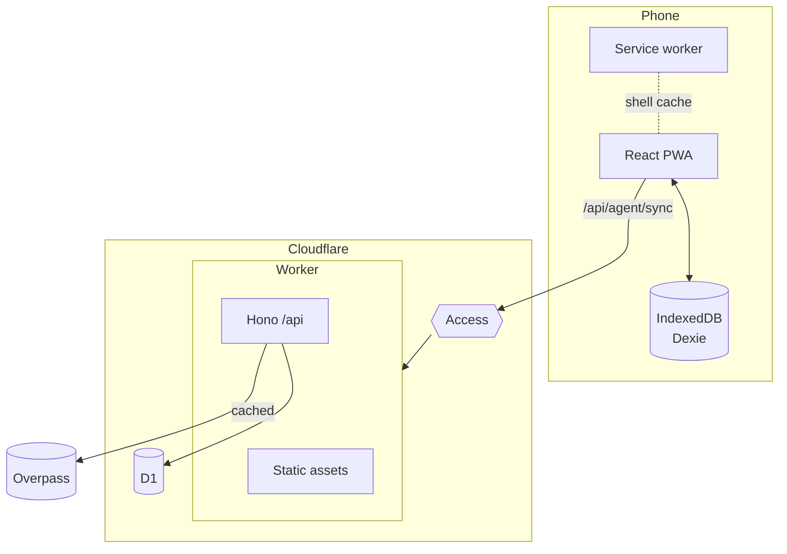
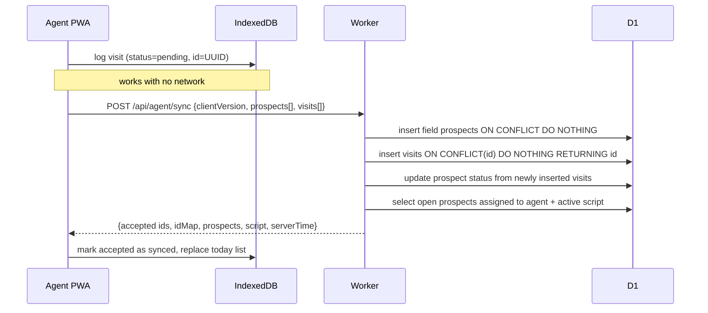

# Architecture

## 1. Context



## 2. Containers

Everything runs in **one Cloudflare Worker**, one deploy ([ADR-0003](adr/0003-single-cloudflare-worker.md)).

| Container | Tech | Responsibility |
|---|---|---|
| Static assets | Vite build served by Workers Static Assets | The SPA/PWA shell. SPA fallback for unknown paths |
| API | Hono, routes under `/api/*` (`run_worker_first`) | Auth, validation, business rules |
| Database | D1 (SQLite) via Drizzle | System of record |
| Client store | Dexie (IndexedDB) on the phone | Offline copy of the today list, outbox of pending writes |
| Service worker | vite-plugin-pwa (Workbox) | Caches the app shell. **Never caches `/api`** |
| Identity | Cloudflare Access | Login (email OTP), signed JWT on every request |



## 3. Repository layout (target)

```
src/
  shared/        zod schemas, constants, pure functions used by both sides
  worker/        Hono app, routes, auth, db schema
  client/        React app, Dexie, sync engine, pages
drizzle/         generated SQL migrations (never hand-edited after merge)
docs/            this documentation
.claude/         AI agent rules, subagents, skills
```

`src/shared` is the contract. Both sides import the same zod schemas; no duplicated types.

### Tests

`pnpm test` runs three vitest projects, one per runtime (`vitest.config.ts`):

| Project | Environment | Covers |
|---|---|---|
| `unit` | node + fake-indexeddb | `src/shared/**/*.test.ts`, `src/client/**/*.test.ts`, `config.test.ts` — pure rules, the Dexie store and the sync engine |
| `worker` | workerd + a local D1 built from `drizzle/` | `src/worker/**/*.test.ts` — routes, auth and queries |
| `dom` | happy-dom + Testing Library | `src/client/**/*.test.tsx` — components: which frame and redirect each route and role gets, the sync strip's live regions, the admin top bar's controls, the field tab bar's leave guard |

The file extension is the whole selector between `unit` and `dom`, so no test
moves between runtimes by accident. The `dom` project stubs
`virtual:pwa-register/react` (`test/stubs/`), since VitePWA is not in the test
pipeline. Testing Library is dev-only and reaches no bundle.

## 4. Key flows

### 4.1 Agent sync (the heart of the system)



Triggers: app start, `online` event, after each visit, every 60 s while open. Details: [domains/field-operations.md](domains/field-operations.md).

### 4.2 Imports
CSV is parsed in the browser; map import goes through the Worker to Overpass. Both end in the same upsert. Details: [domains/ingestion.md](domains/ingestion.md).

### 4.3 Live admin feed
Admin polls `GET /api/admin/visits?since=<ms>` every 15 s ([ADR-0010](adr/0010-live-feed-by-polling.md)).

## 5. Architectural invariants

They are listed once, in [`CLAUDE.md`](../CLAUDE.md#non-negotiable-invariants). Breaking one requires a new ADR.

## 6. Quality attributes

| Attribute | Target | How |
|---|---|---|
| Offline | Full visit workflow with no network | Dexie outbox, app shell cached |
| Latency | Sync < 1 s at p95 on 4G | One round trip, small payloads |
| Cost | 0 | Free tiers only, see [free-tier-budget.md](free-tier-budget.md) |
| Security | No access without Access JWT | JWT verified in the Worker, not just trusted |
| Recoverability | Restore DB to any point in the retention window | D1 Time Travel |
