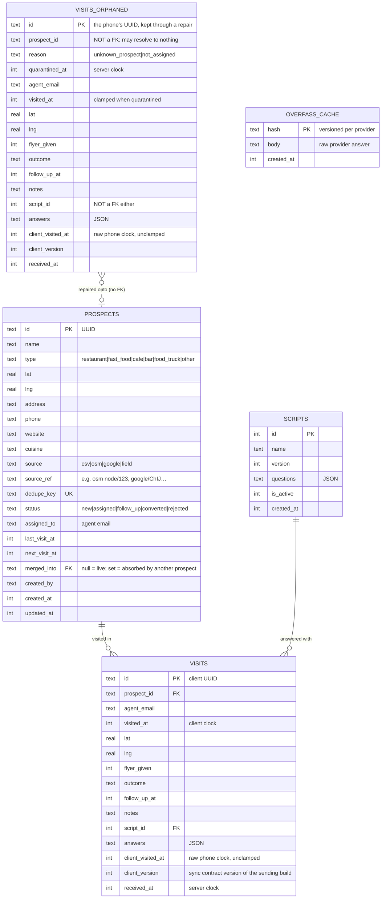

# Data model

Source of truth: `src/worker/db/schema.ts`. This page explains it. Timestamps are epoch milliseconds (integer). IDs of rows created on a phone are client UUIDv4.

`overpass_cache` holds **both** map providers' raw answers (ADR-0020) and keeps the
name of its first one. The hash is SHA-256 of a provider-specific query version plus
the normalised shape — `v1` and a rounded polygon for Overpass, `gv1` and a rounded
centre and radius for Google — so two providers cannot read each other's rows. It has
no eviction path yet (issue #25); a second writer makes that slightly more pressing.

`source` distinguishes `osm` from `google` because the two differ in licence, in
freshness and in `source_ref` format, and because the same restaurant found through
both imports twice: tier 1 of the dedupe key is the source's own id, and `node/4711`
is not `google/ChIJ…`. The duplicates sweep is what resolves that pair.

`visits_orphaned` holds visits the server took but could not place
([ADR-0022](adr/0022-quarantine-visits-the-server-cannot-take.md)): the prospect does not
exist, or it belongs to another agent. It mirrors `visits` so a repair is a straight
copy, and carries no foreign keys at all — `prospect_id` pointing at nothing is the
state the table exists to hold, and `script_id` follows the same rule sync already
applies, where an unknown questionnaire is nulled rather than costing the visit.

Rows leave it in exactly two ways: repaired, which inserts into `visits` and deletes
here in one batch, or discarded by an admin. Once a visit is quarantined the phone has
been told it is `accepted` and has dropped it, so this table is the only copy.

## Rules
- **A visit is kept for ever; its personal fields are not.** `lat`, `lng` and `notes` are nulled once `received_at` is older than `RETENTION_DAYS` (90), by a daily Cron Trigger ([ADR-0023](adr/0023-retention-by-redaction.md)). This is the single exception to `visits` being append-only: no row is deleted and nothing sync or the derived status reads is touched.
- A quarantined visit is not in the prospect's history or the live feed until it is repaired. Why it is still reported in `accepted`: [field-operations](domains/field-operations.md#rules).

- **Visits are append-only.** Never updated, never deleted by the app. A revisit is a new row.
- **Answers live on the visit** as JSON, keyed by question `key`. The visit references the exact `script_id` (a specific version), so answers stay interpretable after the script changes.
- **Scripts are immutable per version.** Editing a script creates version N+1 and makes it active.
  Two partial/unique indexes hold the rules the domain doc states rather than trusting the route:
  `scripts_one_active_idx` is unique on `is_active` **where `is_active = 1`**, so any number of old
  versions rest outside it and two live ones cannot exist; `scripts_name_version_idx` makes
  `(name, version)` the real identity of a version. A visit references the script's `id`, never its
  version number, so renumbering a version never rewrites history.
- **An unknown `script_id` arriving on a visit is nulled, not rejected.** It is a foreign key, so a
  phone holding a visit answered against a script this database does not have would otherwise fail
  the whole chunked insert. The visit is still true — only the questionnaire reference is stale — and
  INVARIANT 5 says never lose one. See `src/worker/routes/agent.ts`.
- **Two clocks on a visit.** `visited_at` is when it happened (phone clock), `received_at` is when the server got it. The live feed uses `received_at`; history uses `visited_at`.
- **`visited_at` is clamped** on insert ([prospecting](domains/prospecting.md#prospect-lifecycle)); the
  unclamped value stays in `client_visited_at`.
- **`client_version` records the sync contract version of the build that sent the visit.** It makes
  "have all phones upgraded?" a SQL query instead of a log search, which is the gate for raising
  `MIN_CLIENT_VERSION` (`sync-contract-change` skill).
- **No users table.** Identity is the email asserted by Cloudflare Access ([ADR-0006](adr/0006-cloudflare-access-auth.md)). Role comes from the `ADMIN_EMAILS` variable.
- **A merge is soft.** `merged_into` points at the survivor; nothing is deleted and no visit is
  repointed, because visits are append-only. The absorbed prospect keeps its own visits, its own
  status and its own dedupe key, which is what makes a merge reversible
  ([prospecting](domains/prospecting.md#merging)).
- **Every query that lists live prospects filters `merged_into IS NULL`.** That is the admin list and
  its count, the agent's sync pull, and the duplicate sweep. The import instead *follows* the
  pointer: a key landing on an absorbed row updates the survivor.

## Indexes

| Index | Serves |
|---|---|
| `prospects(dedupe_key)` unique | import upsert, field-prospect dedupe |
| `prospects(assigned_to, status)` | sync pull |
| `prospects(status)` | admin list filtered by status |
| `prospects(source)` | admin list filtered by source (`csv`, `osm`, `google`, `field`) |
| `prospects(updated_at)` | admin list default order |
| `prospects(merged_into)` | live-prospect filter, and finding what a survivor absorbed |

SQLite uses one index per table reference, so a filtered *and* sorted admin list
(`status=X` ordered by `updated_at`) filters on the index and then sorts the
matches in memory. Composite `(status, updated_at)`-style indexes would remove
that sort, and were deliberately not added: at the few thousand prospects this
project plans for, the sort is negligible, and three more indexes would cost a
write on every imported row. Revisit if the base grows by an order of magnitude.
| `visits(prospect_id, visited_at)` | visit history on a prospect |
| `visits(received_at)` | live feed |
| `visits(agent_email, visited_at)` | an agent's own history |
| `scripts(is_active)` | the sync pull's "which script is live" |
| `scripts(is_active)` unique **where `is_active = 1`** | "exactly one active script at a time" |
| `scripts(name, version)` unique | a version is a version *of* a script |
| `visits_orphaned(quarantined_at)` | the repair queue's only ordering |

No index on `visits_orphaned(reason)`. An empty queue is the healthy state and the page
is capped at 200, so filtering it is a scan over a handful of rows; an index would cost a
write on every quarantined visit to save nothing measurable.
