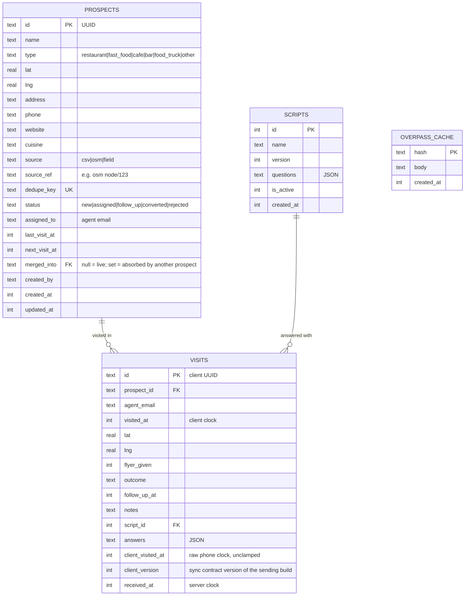

# Data model

Source of truth: `src/worker/db/schema.ts`. This page explains it. Timestamps are epoch milliseconds (integer). IDs of rows created on a phone are client UUIDv4.

## Rules

- **Visits are append-only.** Never updated, never deleted by the app. A revisit is a new row.
- **Answers live on the visit** as JSON, keyed by question `key`. The visit references the exact `script_id` (a specific version), so answers stay interpretable after the script changes.
- **Scripts are immutable per version.** Editing a script creates version N+1 and makes it active.
- **Two clocks on a visit.** `visited_at` is when it happened (phone clock), `received_at` is when the server got it. The live feed uses `received_at`; history uses `visited_at`.
- **`visited_at` is clamped** to `min(visited_at, received_at)` on insert, because a phone's clock can
  be wrong and a future-dated visit would freeze a prospect's status forever
  ([prospecting](domains/prospecting.md)). The unclamped value stays in `client_visited_at`.
- **`client_version` records the sync contract version of the build that sent the visit.** It makes
  "have all phones upgraded?" a SQL query instead of a log search, which is the gate for raising
  `MIN_CLIENT_VERSION` (`sync-contract-change` skill).
- **No users table.** Identity is the email asserted by Cloudflare Access ([ADR-0006](adr/0006-cloudflare-access-auth.md)). Role comes from the `ADMIN_EMAILS` variable.
- **A merge is soft.** `merged_into` points at the survivor; nothing is deleted and no visit is
  repointed, because visits are append-only. The absorbed prospect keeps its own visits, its own
  status and its own dedupe key, which is what makes a merge reversible
  ([prospecting](domains/prospecting.md#merging)).
- **Every query that lists live prospects filters `merged_into IS NULL`.** That is the admin list and
  its count, the agent's sync pull, and the duplicate sweep. The import instead *follows* the
  pointer: a key landing on an absorbed row updates the survivor.

## Indexes

| Index | Serves |
|---|---|
| `prospects(dedupe_key)` unique | import upsert, field-prospect dedupe |
| `prospects(assigned_to, status)` | sync pull |
| `prospects(status)` | admin list filtered by status |
| `prospects(source)` | admin list filtered by source |
| `prospects(updated_at)` | admin list default order |
| `prospects(merged_into)` | live-prospect filter, and finding what a survivor absorbed |

SQLite uses one index per table reference, so a filtered *and* sorted admin list
(`status=X` ordered by `updated_at`) filters on the index and then sorts the
matches in memory. Composite `(status, updated_at)`-style indexes would remove
that sort, and were deliberately not added: at the few thousand prospects this
project plans for, the sort is negligible, and three more indexes would cost a
write on every imported row. Revisit if the base grows by an order of magnitude.
| `visits(prospect_id, visited_at)` | visit history on a prospect |
| `visits(received_at)` | live feed |
| `visits(agent_email, visited_at)` | an agent's own history |
