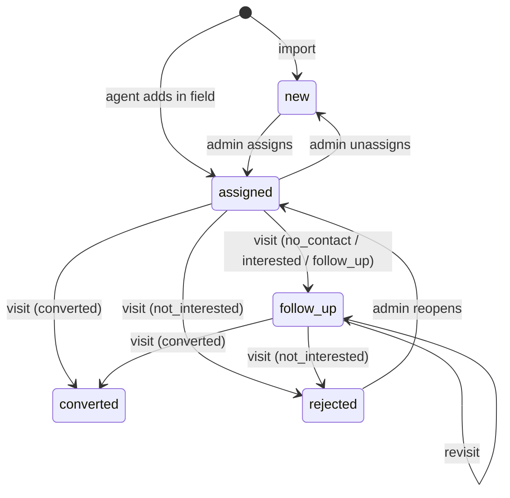

# Prospecting

## Prospect lifecycle

| Visit outcome | Resulting status |
|---|---|
| `no_contact` | `follow_up` |
| `interested` | `follow_up` |
| `follow_up` | `follow_up` |
| `not_interested` | `rejected` |
| `converted` | `converted` |

- Status transitions caused by visits are **computed by the server** when a visit is received ([ADR-0011](../adr/0011-server-derived-prospect-status.md)).
- Only the **latest visit by `visited_at`** moves the status. A late-syncing older visit is stored but does not overwrite a newer outcome.
- Only the **assignee's** visit moves the status. A visit written by any other agent is
  quarantined instead of stored, so it derives nothing until an admin attaches it
  ([ADR-0022](../adr/0022-quarantine-visits-the-server-cannot-take.md)) — otherwise
  either agent could reject a prospect out of the other's round. A prospect reassigned
  while a visit for it was queued offline ends up there too: the visit is real and is
  kept, and repairing it from the queue derives the status exactly as a sync would.
- **`visited_at` is clamped on insert** to `min(visited_at, received_at)`. It comes from the phone's
  clock, which can be wrong. Without the clamp, one phone set days ahead writes a future-dated visit
  that wins every subsequent comparison and freezes that prospect's status permanently. The raw
  client value is kept in `visits.client_visited_at` so the skew stays visible.
- `next_visit_at` = `follow_up_at` of the latest visit, if any.
- Admin can override status manually (reopen, close). Last write wins; this is acceptable because admin edits are rare and deliberate.

## Open vs closed
Open (appear on an agent's list): `new`, `assigned`, `follow_up`. Closed: `converted`, `rejected`.

## Assignment
- A prospect has zero or one `assigned_to` agent (email).
- Admin assigns individually or in bulk (by selection or map area).
- Field prospects are assigned to the agent who created them.

## Dedupe
One place must exist once. The **dedupe key** (unique) is computed server-side:

1. `ref:<source_ref>` when the source gives a stable id (OSM `node/123`).
2. otherwise `geo:<normalized name>:<lat 3dp>:<lng 3dp>` (≈110 m cell).
3. otherwise `addr:<normalized name>:<normalized address>`.

Normalisation: strip accents, lowercase, collapse non-alphanumerics.

Known limits, accepted for v1; the admin can merge manually later (roadmap M5):

- Two branches of the same chain in the same cell merge; the same place just across a cell boundary does not.
- **A rename is a new prospect.** Tiers 2 and 3 are built from the name, so correcting a spelling in the spreadsheet and re-importing creates a second row rather than updating the first. Only tier 1 — a source that supplies a stable `source_ref`, such as OSM — survives a rename.
- The dedupe key is **import-time identity and is never recomputed**. Editing a name or address through `PATCH /api/admin/prospects/:id` leaves the key as it was, because recomputing it could collide with the unique index and fail an otherwise valid edit.

## Rules
- Re-importing updates descriptive fields (name, phone, website, address, cuisine, coordinates). It **never** touches status, assignment or visit history. A changed *name* only reaches an existing row through tier 1 of the dedupe key; see the limits above.
- An import overwrites a field **only when it carries a value for it**. A column left unmapped sends nothing, and the stored value stays as it was — otherwise forgetting to map the phone column would erase every phone number in the base. The spreadsheet is authoritative about what it says, not about what it omits. Clearing a field on purpose is what `PATCH` is for. `name` and `type` are the exceptions: name is required, and type carries a default, so neither can arrive empty to mean "unchanged".
- An import never reports "skipped": a row matching an existing key is an update, which is the point of re-importing. The result is `{created, updated}`.
- Duplicate rows **within one import request** collapse to one before they reach the database; the last one wins. SQLite refuses an `ON CONFLICT DO UPDATE` that would touch the same row twice in one statement.
- Assignment moves status along exactly two edges: `new → assigned` when a prospect is assigned, `assigned → new` when it is unassigned. A prospect whose status came from a visit (`follow_up`, `converted`, `rejected`) keeps it.
- Prospects are never hard-deleted once they have visits.

## Merging

A rename slips past the dedupe key, so the same place ends up as two prospects and an agent walks to the same door twice. The admin resolves it by hand, because a rename and a takeover — a restaurant closing and a new one opening at the same address — are indistinguishable in the data, and a wrong guess would hand a brand-new business the previous tenant's visit history.

**Finding candidates.** Two live prospects are proposed as the same place when they are **within 50 m** *and* their names are alike: they share a meaningful word, or their edit distance is within a quarter of the longer name. Words that say what kind of place it is rather than which one — `le`, `chez`, `restaurant`, `bar`, `bistrot`, and what it sells, `pizza`, `sushi`, `burger`… — do not count as a shared word. Without that, the first sweep against real data proposed two unrelated pizzerias thirty metres apart. If either side has no coordinates, only an exact normalised name match counts. The rule lives in `src/shared/similarity.ts`.

**What a merge does.** It sets `merged_into` on the absorbed prospect and nothing else:

- The absorbed prospect **keeps its own visits**. No visit is repointed — visits are append-only — so a merge is reversible, and unmerging returns the prospect to the list intact.
- The survivor **keeps its own status and assignment**. It does not inherit the other's: status is derived from a prospect's own visits, and those stayed where they were.
- The survivor's dedupe key is **recomputed** from its current fields, so the next import of the current spelling matches instead of duplicating again. If that key already belongs to another prospect the old one is kept and the response says so — the import follows `merged_into` in that case, so nothing breaks either way.
- Merging the same pair twice is a no-op. Merging a prospect that is already absorbed is refused: unmerge it first.

**What a merge does not do.** It does not combine two prospects' visit histories into one record. The survivor's history is its own. Reading the full history of a place that was merged means reading both prospects.

## Export

`GET /api/admin/prospects/export.csv` hands the ledger to a spreadsheet, filtered
exactly as the list screen filters it and excluding merged prospects like every
other list. Timestamps become ISO-8601 and the file carries the OSM attribution
on its last line (`docs/api.md`). There is no download button yet — the endpoint
ships first, the screen needs a design pass.
