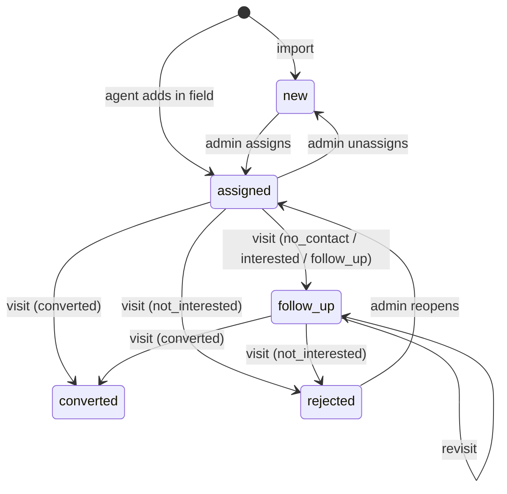

# Prospecting

## Prospect lifecycle

| Visit outcome | Resulting status |
|---|---|
| `no_contact` | `follow_up` |
| `interested` | `follow_up` |
| `follow_up` | `follow_up` |
| `not_interested` | `rejected` |
| `converted` | `converted` |

- Status transitions caused by visits are **computed by the server** when a visit is received ([ADR-0011](../adr/0011-server-derived-prospect-status.md)).
- Only the **latest visit by `visited_at`** moves the status. A late-syncing older visit is stored but does not overwrite a newer outcome.
- **`visited_at` is clamped on insert** to `min(visited_at, received_at)`. It comes from the phone's
  clock, which can be wrong. Without the clamp, one phone set days ahead writes a future-dated visit
  that wins every subsequent comparison and freezes that prospect's status permanently. The raw
  client value is kept in `visits.client_visited_at` so the skew stays visible.
- `next_visit_at` = `follow_up_at` of the latest visit, if any.
- Admin can override status manually (reopen, close). Last write wins; this is acceptable because admin edits are rare and deliberate.

## Open vs closed
Open (appear on an agent's list): `new`, `assigned`, `follow_up`. Closed: `converted`, `rejected`.

## Assignment
- A prospect has zero or one `assigned_to` agent (email).
- Admin assigns individually or in bulk (by selection or map area).
- Field prospects are assigned to the agent who created them.

## Dedupe
One place must exist once. The **dedupe key** (unique) is computed server-side:

1. `ref:<source_ref>` when the source gives a stable id (OSM `node/123`).
2. otherwise `geo:<normalized name>:<lat 3dp>:<lng 3dp>` (≈110 m cell).
3. otherwise `addr:<normalized name>:<normalized address>`.

Normalisation: strip accents, lowercase, collapse non-alphanumerics.

Known limits: two branches of the same chain in the same cell merge; the same place just across a cell boundary does not. Accepted for v1. The admin can merge manually later (roadmap).

## Rules
- Re-importing updates descriptive fields (name, phone, website, address, cuisine, coordinates). It **never** touches status, assignment or visit history.
- Prospects are never hard-deleted once they have visits.
